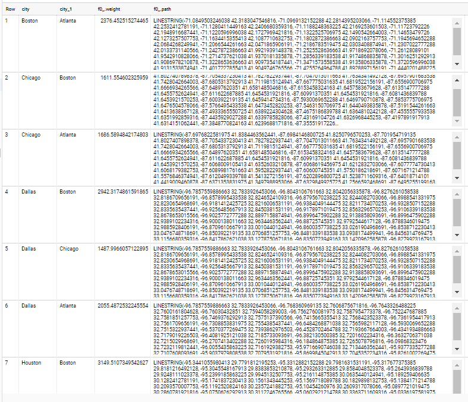

# Bigquery routing
Bigquery user-defined functions (UDFs) for routing/path finding.
Find shortest path through a network of Bigquery geography.

This project wraps [Per Liedman's GeoJSON Path Finder library](https://github.com/perliedman/geojson-path-finder/) to be run on Bigquery.

## Off-the-Shelf Demo
For this demo we use an webpack version of the [Per Liedman's GeoJSON Path Finder library with some tweaks](https://github.com/francois-baptiste/geojson-path-finder/blob/webpack/geojson_path_finder.js) that I host for you on publicly GCS at gs://bigquery-geolib/geojson_path_finder.js

We also use one of the few network available from BigQuery public dataset: `bigquery-public-data:geo_us_boundaries.railways`. Unfortunately, the network is discontinuous in several places, thus preventing significant routing planning. If you want great railroads network datasets, I advise you to look at the [Natural Earth dataset](#playing-with-natural-earth-dataset).

Open a Bigquery console, copy, paste and run this query:
```sql
WITH SOME_CITIES as (
select "OSKALOOSA " city, 41.290438 lat, -92.638499 lon union all 
select "NEW SHARON " city, 41.470103 lat, -92.650924 lon union all
select "GRINELL " city, 41.738154 lat, -92.724915 lon union all
select "MARSCHALLTOWN " city, 42.049467 lat, -92.908037 lon union all
select "COLO " city, 42.014482 lat, -93.318599 lon union all
select "DES MOINES " city, 41.619549 lat, -93.598022 lon
),
mynetwork as (
select array_agg(railway_geom) railways
FROM `bigquery-public-data.geo_us_boundaries.railways`
where full_name="Union Pacific RR" and ST_DISTANCE(railway_geom, ST_GEOGPOINT(-93,42)) <100000
)
select a.city, b.city, libjs4us.routing.geojson_path_finder(railways, ST_GEOGPOINT(a.lon,a.lat), ST_GEOGPOINT(b.lon,b.lat)) shortest_path
FROM mynetwork , SOME_CITIES a, SOME_CITIES b
where a.city>b.city
```
This query returns for each couple of cities the weight (the distance in this case) and the path of the shortest route through the rail network:


## Playing with Natural Earth dataset
I write a python script intended to be run on the Google Cloud Shell to load [Natural Earth dataset](https://www.naturalearthdata.com/).
You can get the gist [here](https://gist.github.com/francois-baptiste/bd6694dbcab836aa1e1bb96815a13a8d).


It creates a Bigquery dataset named `natural_earth_vector` containing a lot of tables with geography of states, provinces, boundary, countries, regions, rivers, lakes , islands, ocean, populated area, ice shelves, coastline, parks, airports, ports, railroads, roads...

You can now test the routing algorithm at a larger scale over the neatly connected natural earth railroads database:

```
WITH SOME_CITIES as (
select "New York" city, 40.6943 lat, -73.9249 lon union all
select "Los Angeles" city, 34.1139 lat, -118.4068 lon union all
select "Chicago" city, 41.8373 lat, -87.6862 lon union all
select "Miami" city, 25.7839 lat, -80.2102 lon union all
select "Dallas" city, 32.7936 lat, -96.7662 lon union all
select "Philadelphia" city, 40.0077 lat, -75.1339 lon union all
select "Houston" city, 29.7863 lat, -95.3889 lon union all
select "Atlanta" city, 33.7627 lat, -84.4224 lon union all
select "Washington" city, 38.9047 lat, -77.0163 lon union all
select "Boston" city, 42.3188 lat, -71.0846 lon union all
select "Phoenix" city, 33.5722 lat, -112.0891 lon union all
select "Seattle" city, 47.6211 lat, -122.3244 lon union all
select "San Francisco" city, 37.7562 lat, -122.443 lon union all
select "Detroit" city, 42.3834 lat, -83.1024 lon 
),
mynetwork as (
select array_agg(ST_GEOGFROMGEOJSON(GEOMETRY)) railways
FROM `replace_with_your_dataset.natural_earth_vector.ne_10m_railroads_north_america`
)
select a.city, b.city, `libjs4us.routing.geojson_path_finder`(railways, ST_GEOGPOINT(a.lon,a.lat), ST_GEOGPOINT(b.lon,b.lat))
FROM mynetwork , SOME_CITIES a, SOME_CITIES b
where a.city>b.city
```



NOTE: For EU located data the same function is available at `libjs4eu.routing` dataset.


You can reproduce the path search logic directly on your browser using the same JS library via the Per Liedman's [demo page adapted for the circumstance](https://francois-baptiste.github.io/bigquery-routing/).

## Weight functions

By default, the _cost_ of going from one node in the network to another is determined simply by
the geographic distance between the two nodes. This means that, by default, shortest paths will be found.
You can however override this by providing a cost calculation function through the `weightFn` option

The [live demo](https://francois-baptiste.github.io/geojson-path-finder/) around Gothenburg proposed by Per Liedman uses the speed limit extacted from OSM to choose the fastest route in terms of time.
You can load the graph to bigquery from google cloud shell using this python [script](/examples/custom_weightFn/upload_network_to_bigquery.py) and run this demo on bigquery using this [query](/examples/custom_weightFn/query.sql).

You can download the network to bigquery 
## Playing with OpenStreetMap data snapshot accessible from BigQuery

TODO
